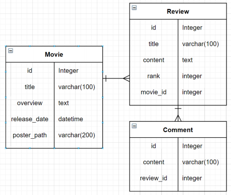
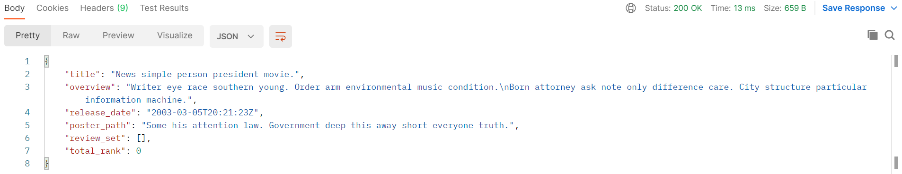
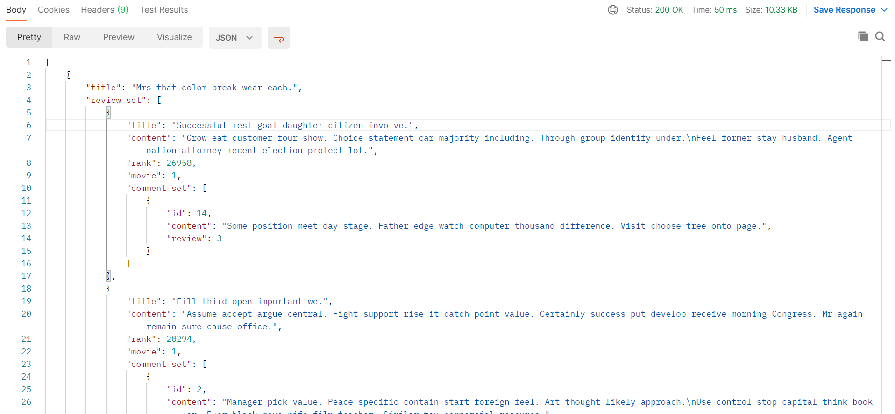
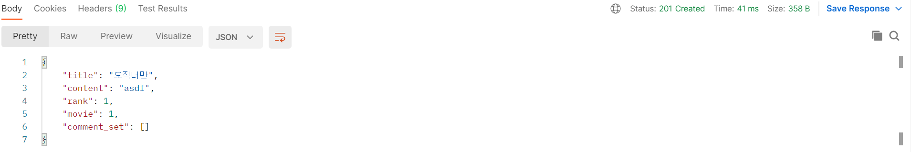
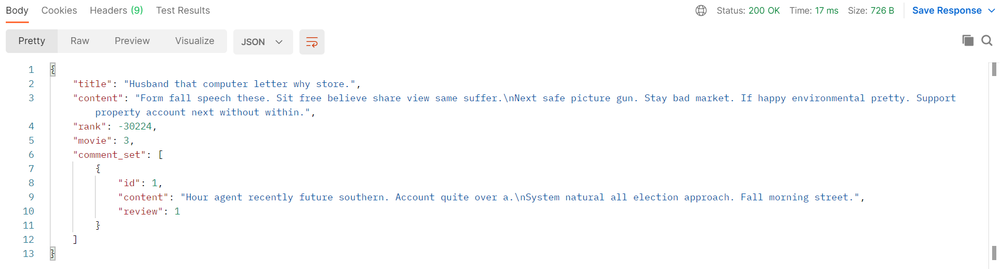
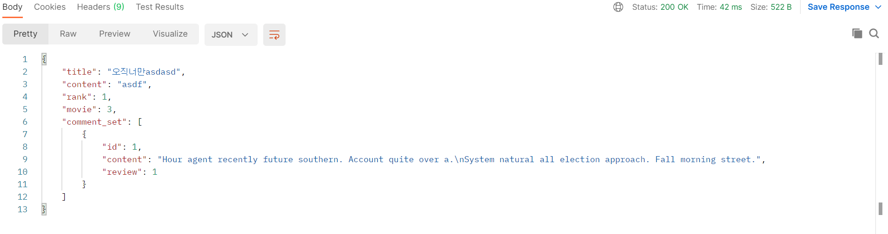
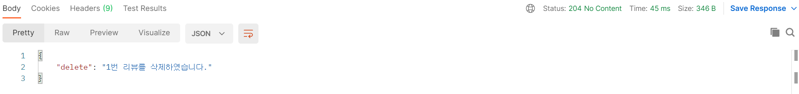
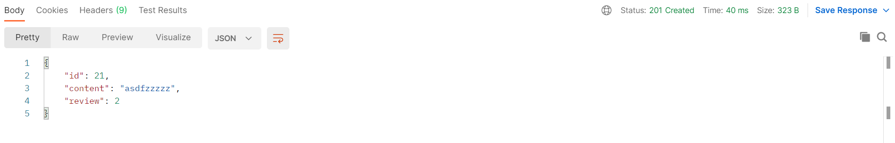

# PJT 08 - 데이터베이스 설계를 통한 REST API 설계


## 1. 목표

- 데이터를 생성, 조회, 수정, 삭제할 수 있는 API Server 제작
- Django Rest Framework를 통한 데이터 조작
- Database 관계의 이해와 설정


## 2. 준비사항

### A. 언어

- Python 3.8+
- Django 3.x

### B. 도구

- vsCode
- Chrome Browser
- Postman

### C. 기타

- djangrestframework 
- django-seed 

```bash
# bash
# 가상 환경으로 실행 및 필요한 라이브러리 설치
$ python -m venv venv
$ source venv/Script/activate
$ pip install django djangorestframework django-seed
$ pip freeze > requirements.txt
```


## 3. 요구사항 및 구현 내용

> 커뮤니티 서비스의 상세 기능 개발을 위한 단계로, 모델간의 관계 설정 후 데이터의 생성, 수정, 삭제할 수 있는 기능을 완성합니다. 해당 기능은 향후 커뮤니티 서비스의 필수 기능으로 사용됩니다.


### A. 프로젝트 구조

> **요구사항**
>
> - project name : pjt08
>
> - application name : movies
>
> - 폴더 구조
>
>   - ```
>     pjt08/
>     	settings.py
>     	urls.py
>     moives/
>     	migrations/
>     	models.py
>     	serializers.py
>     	urls.py
>     	views.py
>     manage.py
>     ...
>     ```

```bash
# bash
# Project, Application 만들기

$ django-admin startproject pjt08 .
$ python manage.py startapp movies
```

```python
# settings.py

INSTALLED_APPS = [
    'movies',
    'rest_framework',
    'django-seed',
    ...
]
```


### B. Model

> **요구사항 **
>
> - 데이터베이스에서 모델의 ERD(Entity Relation Diagram) 예시는 아래와 같습니다.
>
> 

**구현내용**

```python
# movies/models.py

from django.db import models


class Movie(models.Model):
    title = models.CharField(max_length=100)
    overview = models.TextField()
    release_date = models.DateTimeField()
    poster_path = models.CharField(max_length=200)


class Review(models.Model):
    title = models.CharField(max_length=100)
    content = models.TextField()
    rank = models.IntegerField()
    movie = models.ForeignKey(Movie, on_delete=models.CASCADE)
    
    
class Comment(models.Model):
    content = models.TextField()
    review = models.ForeignKey(Review, on_delete=models.CASCADE)
```

```bash
# bash
# DB 테이블 만들고, 더미 데이터 넣기

$ python manage.py makemigrations
$ python manage.py migrate
$ python manage.py seed movies --number=20
```


### C. URL

> **요구사항**
>
> [TMDB](https://developers.themoviedb.org/3) API 문서를 참고하여 페어와 의논 후 URL을 RESTful하게 구성합니다.

**구현내용**

```python
from django.urls import path
from . import views

app_name = "movies"

urlpatterns = [
    # 전체영화 정보
    path("movies/", views.movie_list),
    # 점수 상위 5개 정보
    path("movies/top_rated/", views.movie_top_rated),
    # 단독영화 정보
    path("movies/<int:movie_pk>/", views.movie_detail),
    # 리뷰 생성
    path("movies/<int:movie_pk>/review/", views.review_create),
    # 리뷰정보 조회
    path("reviews/<int:review_pk>/", views.review_detail),
    # 댓글 생성
    path("reviews/<int:review_pk>/comment/", views.comment_create),
    # 댓글 정보 조회
    path("comments/<int:comment_pk>/", views.comment_detail),
]
```


### D. Serializer & View

#### i. Serializer

1. Model과 URL에 적절한 Serializer를 생성합니다.

   - ```python
     from rest_framework import serializers
     from .models import Movie, Review, Comment
     
     
     class CommentSerializer(serializers.ModelSerializer):
         class Meta:
             model = Comment
             fields = "__all__"
             read_only_fields = ("review",)
     
     
     class ReviewSerializer(serializers.ModelSerializer):
         comment_set = CommentSerializer(
             many=True, read_only=True
         )
     
         class Meta:
             model = Review
             fields = [
                 "title", "content", "rank",
                 "movie", "comment_set",
             ]
             read_only_fields = ["movie", ]
     
     
     class MovieListSerializer(serializers.ModelSerializer):
         review_set = ReviewSerializer(many=True, read_only=True)
     
         # total = serializers.IntegerField(source="total_rank", read_only=True)
     
         # 모델 폼 처럼
         class Meta:
             model = Movie
             fields = ("title", "review_set", "total_rank", )
     
     
     class MovieSerializer(serializers.ModelSerializer):
         review_set = ReviewSerializer(many=True, read_only=True)
     
         class Meta:
             model = Movie
             fields = (
                 "title", "overview", "release_date",
                 "poster_path", "review_set", "total_rank",
             )
     
     ```

#### ii. Movie

1. 영화 정보 제공을 위한 기능을 구성합니다.

   1. 단일열화 정보를 제공합니다.

      - ```python
        # views.py
        from django.shortcuts import get_obejct_or_404
        from rest_framework.response import Response
        from rest_framework.decorators import api_view
        from .serializers import MovieSerializer
        from .models import Movie
        
        @api_view(["GET"])
        def movie_detail(request, movie_pk):
            movie = get_object_or_404(Movie, pk=movie_pk)
            serializer = MovieSerializer(movie)
            return Response(data=serializer.data)
        ```

      - 

   2. 전체영화 정보를 제공합니다.

      - ```python
        # views.py
        from django.shortcuts import get_list_or_404
        from .serializers import MovieListSerializer
        from rest_framework.response import Response
        from rest_framework.decorators import api_view
        from .models import Movie
        
        @api_view(["GET"])
        def movie_list(request):
            movies = get_list_or_404(Movie)
            serializer = MovieListSerializer(movies, many=True)
            return Response(data=serializer.data)
        ```

      - 

#### iii. Review

1. 리뷰 정보 제공을 위한 기능을 구현합니다.

   1. 리뷰를 생성합니다.

      - ```python
        # views.py
        from rest_framework.decorators import api_view
        from django.shortcuts import get_object_or_404
        from .models import Movie
        from .serializers import ReviewSerializer
        from rest_framework.response import Response
        from rest_framework import status
        
        @api_view(["POST"])
        def review_create(request, movie_pk):
            movie = get_object_or_404(Movie, pk=movie_pk)
            serializer = ReviewSerializer(data=request.data)
            if serializer.is_valid(raise_exception=True):
                serializer.save(movie=movie)
                return Response(serializer.data, status=status.HTTP_201_CREATED)
        ```

      - 

   2. 리뷰정보를 반환합니다.

   3. 리뷰를 수정합니다.

   4. 리뷰를 삭제합니다.

      - ```python
        # views.py
        from rest_framework.decorators import api_view
        from django.shortcuts import get_object_or_404
        from .models import Review
        from .serializers import ReviewSerializer
        from rest_framework.response import Response
        from rest_framework import status
        
        @api_view(["GET", "PUT", "DELETE"])
        def review_detail(request, review_pk):
            review = get_object_or_404(Review, pk=review_pk)
            # 2. 리뷰정보를 반환합니다.
            if request.method == "GET":
                serializer = ReviewSerializer(review)
                return Response(data=serializer.data)
            # 3. 리뷰를 수정합니다.
            elif request.method == "PUT":
                serializer = ReviewSerializer(review, request.data)
                if serializer.is_valid(raise_exception=True):
                    serializer.save()
                    return Response(serializer.data, status=status.HTTP_200_OK)
        	# 4. 리뷰를 삭제합니다.
            elif request.method == "DELETE":
                review.delete()
                data = {
                    "delete": f"{review_pk}번 리뷰를 삭제하였습니다.",
                }
                return Response(data, status=status.HTTP_204_NO_CONTENT)
        ```

      - 

      - 

      - 

#### iv. Comment

1. 댓글 정보 제공을 위한 기능을 구성합니다.

   1. 댓글을 생성합니다.

      - ```python
        # views.py
        from rest_framework.decorators import api_view
        from django.shortcuts import get_object_or_404
        from .models import Review
        from .serializers import CommentSerializer
        from rest_framework.response import Response
        from rest_framework import status
        
        @api_view(["POST"])
        def comment_create(request, review_pk):
            review = get_object_or_404(Review, pk=review_pk)
            serializer = CommentSerializer(data=request.data)
            if serializer.is_valid(raise_exception=True):
                serializer.save(review=review)
                return Response(serializer.data, status=status.HTTP_201_CREATED)
        ```

      - 

   2. 댓글정보를 반환합니다.

      - ```python
        # views.py
        from rest_framework.decorators import api_view
        from django.shortcuts import get_object_or_404
        from .models import Comment
        from .serializers import CommentSerializer
        from rest_framework.resopnse import Response
        
        @api_view(["GET"])
        def comment_detail(request, comment_pk):
            comment = get_object_or_404(Comment, pk=comment_pk)
            serializer = CommentSerializer(comment)
            return Response(serializer.data)
        ```

      - 


## 4. 어려웠던 부분

- foreignkey로 연결된 모델에 대한 serializer를 구현하기 어려웠다.
  - MovieSerializer를 구현하는데 해당 movie에 대한 review 집합을 구하기 위해 `review_set = ReviewSerializer(many=True, read_only=True)`

- Serializer 객체를 만들 때, instance와 data 인자가 헷갈렸다.
  - DB에서 가져와서 JSON 데이터를 보내고자 할 때 : instance
  - 요청으로 받은 JSON 데이터를 DB에 넣고자 할 때 : data